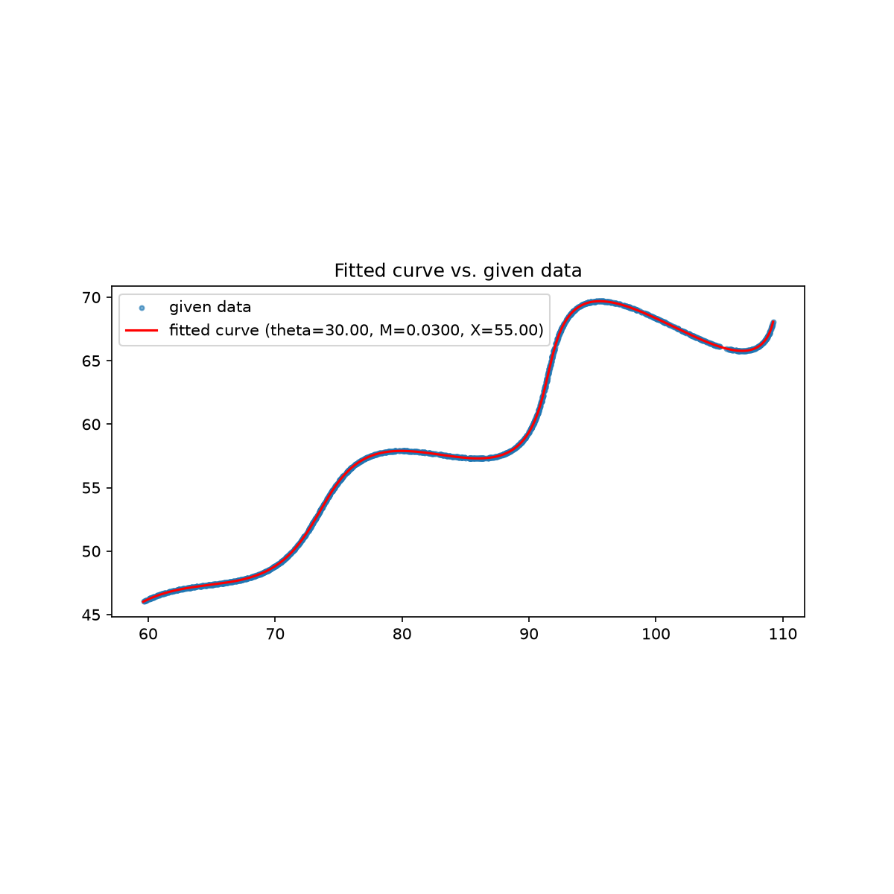

# Parametric Curve Parameter Estimation

## Problem Statement

The task is to recover three unknown parameters — θ, M, and X — from the parametric curve

```
x(t) = t·cos(θ) − e^(M|t|)·sin(0.3t)·sin(θ) + X
y(t) = 42 + t·sin(θ) + e^(M|t|)·sin(0.3t)·cos(θ)
```

defined over `6 < t < 60`, with θ constrained to `0°–50°`, M to `−0.05–0.05`, and X to `0–100`. A file, `xy_data.csv`, contains 1500 `(x, y)` points known to lie on this curve — but crucially, without the `t` values that generated them, and not in any particular order. The problem is therefore to recover θ, M, and X purely from the shape of the point cloud.

## Approach

### Step 1: Reading the geometry before touching any numbers

Rearranging the equations to isolate X and 42 makes the underlying structure visible:

```
(x − X) = t·cos(θ) − v·sin(θ)
(y − 42) = t·sin(θ) + v·cos(θ)      where v = e^(M|t|)·sin(0.3t)
```

This is a standard 2D rotation matrix applied to the point `(t, v)`, followed by a translation. In other words, the curve is not an arbitrary shape to be fitted blindly — it is a simple base curve (a straight `t` axis paired with an exponentially-modulated sine wave) that has been rotated by θ and shifted by X. This observation reframed the problem from "fit three abstract parameters" into "recover a rotation angle, a translation, and a growth rate" — a much more concrete target, and one that shaped both methods below.

### Step 2: Method 1 — global Chamfer-distance fit

Since the data points carry no `t` label, the natural formulation is a point-cloud-to-curve registration problem rather than a direct equation-solving one:

1. For a candidate `(θ, M, X)`, generate the curve densely over `t ∈ [6, 60]`.
2. For each of the 1500 real data points, find the nearest point on that generated curve (L1 / Manhattan distance, matching the assignment's grading metric), using a `cKDTree` for efficient lookup rather than brute-force comparison.
3. Average these nearest-point distances into a single loss value.
4. Minimize this loss over the full parameter space using `scipy.optimize.differential_evolution`, a population-based, gradient-free global optimizer, followed by a local `Nelder-Mead` polish with a finer curve sampling for precision.

L1 distance was used because it's the assignment's own grading metric, and it's also less sensitive to outlier points than a squared (L2) error would be, since it doesn't amplify large individual mismatches the way squaring does. Finding the nearest curve point for all 1500 data points on every single optimizer iteration would be far too slow with brute-force comparison — that would mean comparing each data point against every one of the thousands of sampled curve points, repeated for every candidate the optimizer tries — so a `cKDTree` was used instead, turning each lookup into a fast operation rather than a full scan. For the search itself, `differential_evolution` was chosen over a simple local search because it explores the entire bounded parameter space with a population of candidates rather than improving from one starting guess — important here since the periodic `sin(0.3t)` term makes the loss landscape non-convex, and a purely local method can converge confidently on a wrong answer that only looks like a minimum from nearby. Concretely, the algorithm keeps a pool of candidate `(θ, M, X)` triples, combines and perturbs them across generations, and keeps whichever ones score lower on the loss, which lets it hop between distant regions of the search space rather than getting anchored to wherever it happened to start. A coarser curve sampling (1500 points) was used during this global stage purely for speed, since the objective gets evaluated many thousands of times over the course of the search, while a much finer sampling (20,000 points) was reserved for the final polish, where only a handful of evaluations are needed and precision matters more than speed. That final polish used `Nelder-Mead` rather than a gradient-based method, since the nearest-neighbor lookup makes the loss function technically non-smooth at a fine scale — small parameter changes can abruptly flip which curve point counts as "closest," which confuses methods that rely on a derivative. Nelder-Mead only ever evaluates the function directly, moving and reshaping a small cluster of trial points toward lower loss, so this non-smoothness doesn't affect it the way it would a gradient-based method.

This converged to θ ≈ 30°, M ≈ 0.03, X ≈ 55, with a mean L1 residual near zero.

### Step 3: Method 2 — algebraic inversion with closed-form regression, as an independent check

Rather than accept Method 1's result on its own, a second, structurally different method was used to verify it. The rotation identified in Step 1 can be undone algebraically for any candidate `(θ, X)`, with no search involved:

```
t = (x − X)·cos(θ) + (y − 42)·sin(θ)
v = −(x − X)·sin(θ) + (y − 42)·cos(θ)
```

If `(θ, X)` are correct, the recovered `v` values should satisfy `v = e^(Mt)·sin(0.3t)` for the true M. Taking a logarithm turns this into a linear equation, `ln(v / sin(0.3t)) = M·t`, which means M can be solved directly by ordinary least-squares regression through the origin — no iterative search required for M at all.

This works because θ and X can already be undone exactly with linear algebra for any candidate, so there's no reason to spend optimizer iterations rediscovering something that can be computed directly — that's the whole motivation for a second method: lean on the known structure instead of treating all three unknowns as equally opaque. Turning the exponential relationship into a straight line via a logarithm means solving for M becomes a simple regression instead of another nonlinear search, which is both faster and more numerically reliable, since linear regression has a single closed-form solution with no risk of the optimizer stalling or diverging. Points near the zero-crossings of `sin(0.3t)` were excluded before this regression, since dividing by a value close to zero amplifies any small numerical noise into a huge, misleading value and would distort the fit; points where the resulting ratio came out negative or near zero were dropped too, since `e^(M|t|)` must always be positive by definition, so a bad ratio signals either a wrong `(θ, X)` guess or an unreliable point that shouldn't be trusted. The regression was also forced through the origin, matching the fact that the true model has no constant offset term at `t = 0` — allowing an intercept would let the regression silently absorb some of the error instead of attributing it correctly. Even with M eliminated, the remaining 2D search over θ and X is still non-convex for the same periodic reason as before — an early attempt starting `Nelder-Mead` from an arbitrary point converged on a clearly wrong answer (θ ≈ 14°, high residual) — so a coarse grid scan across the full bounded region was run first to find the correct basin before refining locally, which is cheap here since each evaluation of the reduced 2-parameter objective is fast.

This method converged independently to θ ≈ 30°, M ≈ 0.03, X ≈ 55, matching Method 1 to five-plus decimal places despite using an entirely different mathematical route — one relying on optimization, the other on algebraic inversion plus linear regression. Because the two methods share almost no machinery (different loss functions, different search strategies, and different handling of M), it's very unlikely they'd both land on the same wrong answer by coincidence, which is what makes this agreement meaningful rather than just reassuring.

### Step 4: Validation

**L1 distance.** Using the finalized parameters and a finely sampled version of the fitted curve (50,000 points), the L1 distance from each of the 1500 data points to its nearest curve point was computed directly:

| Metric | Value |
|---|---|
| Mean | 0.000418 |
| Median | 0.000419 |
| Max | 0.001278 |
| Total (summed) | 0.626523 |

Given that the curve spans roughly 50 units in x and 25 in y, distances at the 0.0004-unit scale are effectively noise, not a meaningful mismatch.

**Plotting:** The fitted curve was overlaid on the raw data, both in Python (Matplotlib) and independently in Desmos. In both cases the curve passes through every data point with no visible deviation, including through the most sensitive section of the curve where the wiggle changes direction.



*(generated automatically by `fit_curve.py` — saved as `fit_overlay.png` when the script is run)*

## Final Results

- **θ ≈ 30°** (0.523599 rad)
- **M ≈ 0.03**
- **X ≈ 55**

The closeness of these fitted values to round numbers strongly suggests they are the exact parameters used to generate the dataset, with the small deviations attributable to optimizer tolerance rather than any real fitting error.

## Final Equation

```
\left(t*\cos(0.5236)-e^{0.0300\left|t\right|}\cdot\sin(0.3t)\sin(0.5236)+55,42+t*\sin(0.5236)+e^{0.0300\left|t\right|}\cdot\sin(0.3t)\cos(0.5236)\right)
```

Domain: `6 ≤ t ≤ 60`

**Desmos link:** https://www.desmos.com/calculator/hd1qidriwv

## Files in This Repo

- `fit_curve.py` — full implementation of both methods, plus L1 distance reporting and plot generation
- `Dataset.csv` — the provided data
- `fit_overlay.png` — fitted curve plotted against the given data
- `README.md` — this file

## Tools & References


- [Breaking Down Nelder-Mead](https://brandewinder.com/2022/03/31/breaking-down-Nelder-Mead/) —Explains how the Nelder-Mead algorithm works
- [Chamfer Distance, explained](https://medium.com/@sim30217/chamfer-distance-4207955e8612) — Explains Chamfer distance metric
- [SciPy `differential_evolution` documentation](https://docs.scipy.org/doc/scipy/reference/generated/scipy.optimize.differential_evolution.html) — global optimizer used for Method 1
- [SciPy `minimize` (Nelder-Mead) documentation](https://docs.scipy.org/doc/scipy/reference/optimize.minimize-neldermead.html) — local refinement used in both methods
- [SciPy `cKDTree` documentation](https://docs.scipy.org/doc/scipy/reference/generated/scipy.spatial.cKDTree.html) — nearest-point lookup for the Chamfer/L1 distance
- [NumPy](https://numpy.org/) — vectorized curve evaluation and closed-form linear regression
- [pandas](https://pandas.pydata.org/) — CSV loading and data handling
- [Matplotlib](https://matplotlib.org/) — visualization of fitted curve vs. actual data
- [Desmos](https://www.desmos.com/) — independent visual verification of the final equation
